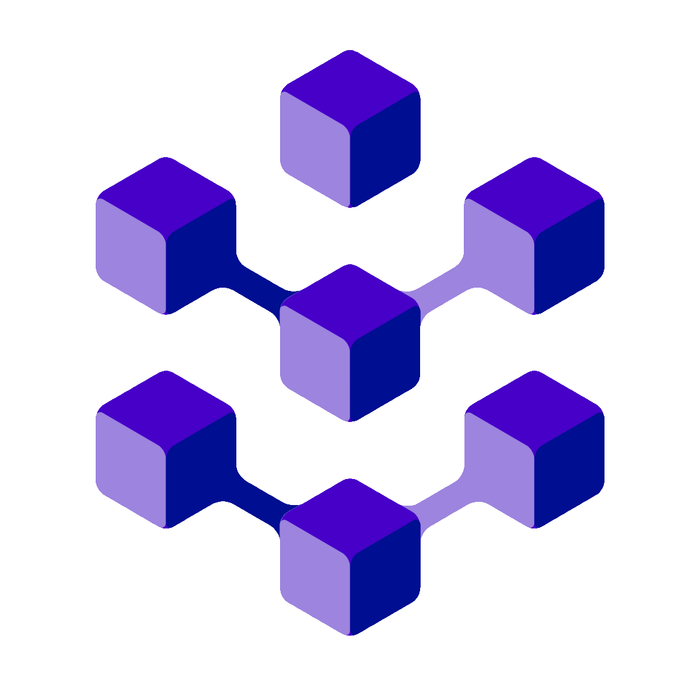

# Velthyding.is — Icelandic Machine Translation Website

## Introduction

*Velthyding.is* is a web front end for [Miðeind](https://miðeind.is)'s neural machine
translation engine, implemented in Javascript and React.

The website allows translation of text and documents between Icelandic and English.
Both the web and the engine are under rapid development.

Try Velthyding at [https://velthyding.is](https://velthyding.is)!

## Development

### Configuration

See `config.js` for setting endpoint domains, default selections and customizing branding (logo, colors). Endpoints need to follow the [Google translate REST specification](https://cloud.google.com/translate/docs/reference/rest) for compatibility with the interface.

### Setup and development

You’ll need to have Node >= 8.10<=14 > and npm >= 5.6 on your machine. To install dependancies run

```bash
npm install
```

To start up the development server run

```bash
npm run-script start
```

To create a build run

```bash
npm run-script build
```

If you run into issues when building or running the development server, try increasing the available memory with 

```bash
export NODE_OPTIONS=--max_old_space_size=4096
```

### Linting

The code should follow the [Airbnb React/JSX Style Guide](https://github.com/airbnb/javascript/tree/master/react). Linting is configured in `.eslintrc.json` and the code can be fixed using prettier by running 

```bash
npx eslint 'src/**/*.{js,jsx}' --fix
```

## About

This work is partially funded by the Language Technology Programme of the Icelandic Government.

### Copyright and licensing


Velthyding is *copyright ©2021 Miðeind ehf.*

This software is licensed under the **MIT License**:

*Permission is hereby granted, free of charge, to any person*
*obtaining a copy of this software and associated documentation*
*files (the "Software"), to deal in the Software without restriction,*
*including without limitation the rights to use, copy, modify, merge,*
*publish, distribute, sublicense, and/or sell copies of the Software,*
*and to permit persons to whom the Software is furnished to do so,*
*subject to the following conditions:*

**The above copyright notice and this permission notice shall be**
**included in all copies or substantial portions of the Software.**

*THE SOFTWARE IS PROVIDED "AS IS", WITHOUT WARRANTY OF ANY KIND,*
*EXPRESS OR IMPLIED, INCLUDING BUT NOT LIMITED TO THE WARRANTIES OF*
*MERCHANTABILITY, FITNESS FOR A PARTICULAR PURPOSE AND NONINFRINGEMENT.*
*IN NO EVENT SHALL THE AUTHORS OR COPYRIGHT HOLDERS BE LIABLE FOR ANY*
*CLAIM, DAMAGES OR OTHER LIABILITY, WHETHER IN AN ACTION OF CONTRACT,*
*TORT OR OTHERWISE, ARISING FROM, OUT OF OR IN CONNECTION WITH THE*
*SOFTWARE OR THE USE OR OTHER DEALINGS IN THE SOFTWARE.*

If you would like to use this software in ways that are incompatible
with the standard MIT license, [contact Miðeind ehf.](mailto:mideind@mideind.is)
to negotiate custom arrangements.
